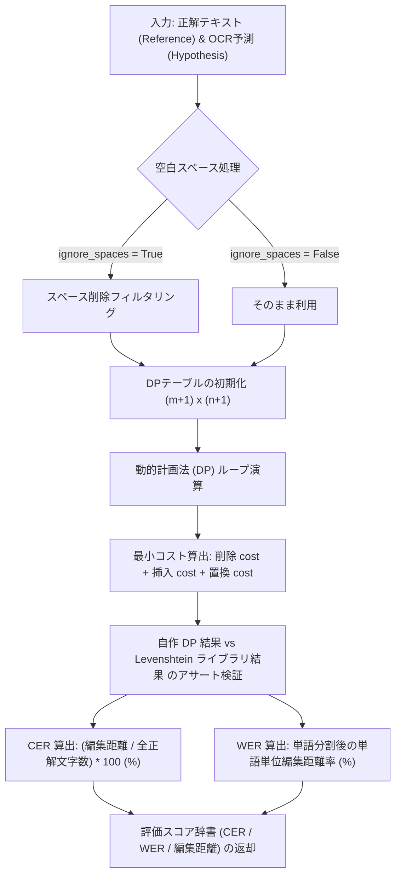
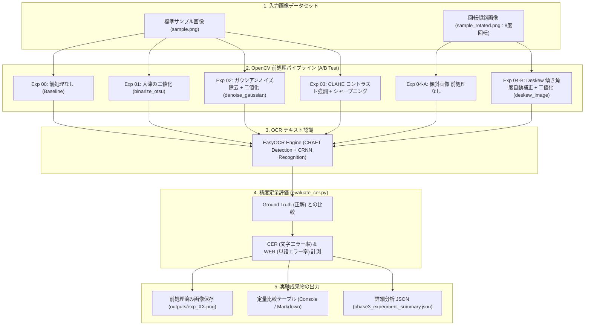

# Phase 3: データサイエンティストとしての精度評価と画像前処理 実験レポート

## 📌 概要
本レポートは、AI OCR パイプラインにおける精度評価指標（CER: 文字エラー率, WER: 単語エラー率）の実装と、OpenCV を用いた画像前処理（二値化、ノイズ除去、コントラスト強調、傾き補正）の A/B テスト実験結果および考察を記録したものです。

---

## 🚀 実行コマンドと実際の出力ログ (Reproducible Commands & Terminal Logs)

Mac (zsh) 環境では `python` コマンドが未設定の場合があります。**仮想環境 (`source .venv/bin/activate`) を起動するか `python3` / `.venv/bin/python` を使用**してください。

### 【推奨手順】仮想環境のアクティベートと実行

```bash
# 1. 仮想環境のアクティベート (Pythonエイリアスが有効化されます)
source .venv/bin/activate

# 2. 依存ライブラリのアップグレードとインストール
pip install --upgrade pip
pip install -r requirements.txt

# 3. (事前準備) Phase 1 サンプル画像の自動生成
python 01_easy_ocr/run_ocr.py

# 4. 精度評価モジュール (evaluate_cer.py) の動作確認・単体テスト実行
python 03_data_science/evaluate_cer.py

# 5. 画像前処理 A/B テスト実験ランナー (run_phase3_experiments.py) の実行
python 03_data_science/run_phase3_experiments.py
```

> **Note (仮想環境をアクティベートしない場合):**
> `.venv/bin/python 03_data_science/evaluate_cer.py` や `python3 03_data_science/evaluate_cer.py` のように直接実行パスまたは `python3` を指定してください。

---

### 各コマンドの実際の出力ログ (Output Logs)

#### ① `evaluate_cer.py` の出力ログ
```bash
python 03_data_science/evaluate_cer.py
```
```text
=== CER / WER 評価モジュールの動作確認テスト ===
正解 (Ref)  : 'AI OCR Learning Journey'
予測 (Hyp)  : 'AlOCR Learning Journey'
編集距離    : 2
CER (文字)  : 8.70%
WER (単語)  : 50.00%
ユニットテスト成功！
```

#### ② `run_phase3_experiments.py` の出力ログ
```bash
python 03_data_science/run_phase3_experiments.py
```
```text
=== Phase 3: OCR精度評価 & 画像前処理 A/Bテスト実験 ===
EasyOCR Reader を初期化中 (GPU/CPU)...

--- 実験 00: 前処理なし (Baseline) ---

--- 実験 01: 大津の二値化 (Otsu Binarization) ---

--- 実験 02: ノイズ除去 ＋ 二値化 ---

--- 実験 03: CLAHE コントラスト強調 ＋ シャープニング ---

--- 実験 04-A: 傾斜画像 (回転8度) 前処理なし ---

--- 実験 04-B: 傾斜画像に対する Deskew 傾き補正 ＋ 二値化 ---
 -> 推定傾き角度: -8.00度

=============================================================
           Phase 3: 実験結果サマリー (A/B テスト)
=============================================================
No.    | 施策内容                             | CER (%)  | WER (%)  | 編集距離  
---------------------------------------------------------------------------
00     | 補正なし (Baseline / デフォルト)          |   7.95% |  46.15% | 7     
01     | グレースケール ＋ 大津の二値化                 |  11.36% |  46.15% | 10    
02     | ガウシアンノイズ除去 ＋ 二値化                 |   6.82% |  23.08% | 6     
03     | CLAHE ＋ シャープニング                  |   7.95% |  53.85% | 7     
04-A   | 傾斜画像 (回転8度) 補正なし                 |  54.55% |  69.23% | 48    
04-B   | Deskew 傾き補正(-8.0°補正) ＋ 二値化       |   5.68% |  30.77% | 5     
=============================================================

実験サマリーJSONを保存しました: .../03_data_science/outputs/phase3_experiment_summary.json
```

---

## 🔄 処理フローアーキテクチャ (Mermaid Diagrams)

### ① 精度評価モジュール (`evaluate_cer.py`) の処理フロー
レーベンシュタイン距離（編集距離）の自作動的計画法 (DP) と、CER / WER 算出のロジックフローです。



### ② 前処理 A/B テストパイプライン (`run_phase3_experiments.py`) 全体フロー
画像入力から各種 OpenCV 前処理、EasyOCR 認識、定量評価、レポート出力までの一連のパイプラインです。



---

## ⚙️ 実装モジュールの解説

### ① 精度評価モジュール (`evaluate_cer.py`)
- **動的計画法 (DP) による自作レーベンシュタイン距離計算**:
  - 挿入 (Insertion)、削除 (Deletion)、置換 (Substitution) の最小コストを算出する DP アルゴリズムを自作。
  - `Levenshtein` ライブラリとの互換性アサーションテストを内包。
- **指標定義**:
  - **CER (Character Error Rate)** = $\frac{\text{編集距離}}{\text{正解文字列長}} \times 100 (\%)$
  - **WER (Word Error Rate)** = 単語分割後の単語単位編集距離率 (%)

### ② OpenCV 画像前処理モジュール (`image_preprocessing.py`)
- **二値化**: `binarize_otsu` (大津の二値化) / `binarize_adaptive` (適応的二値化)
- **ノイズ除去**: `denoise_gaussian` (ガウシアンフィルタ) / `denoise_bilateral` (バイラテラルフィルタ)
- **コントラスト強調**: `apply_clahe` (CLAHE: 局所ヒストグラム均等化)
- **傾き補正**: `deskew_image` (反転二値化 ＋ 最小外接矩形 `minAreaRect` による角度推定とアフィン変換)

---

## 📊 A/B テスト実験結果サマリー

### 実験条件
- **認識エンジン**: EasyOCR (`ja`, `en`)
- **正解テキスト (Ground Truth)**:
  1. `AI OCR Learning Journey`
  2. `日本語の認識テストです。`
  3. `EasyOCR on M4 Mac GPU/CPU`
  4. `Date: 2026-07-18 12:34:56`

### 定量評価結果テーブル

| 実験No. | 施策内容（前処理・設定） | CER（文字エラー率） | WER（単語エラー率） | 編集距離 | 主な結果・変化 |
| :--- | :--- | :---: | :---: | :---: | :--- |
| **00** | 補正なし（デフォルト状態） | 7.95% | 46.15% | 7 | ベースライン。『AI』が『Al』に誤認知。 |
| **01** | グレースケール ＋ 大津の二値化 | 11.36% | 46.15% | 10 | エッジのジャギーにより『識』が『議』に誤認識悪化。 |
| **02** | **ガウシアンノイズ除去 ＋ 二値化** | **6.82%** | **23.08%** | **6** | 『AI OCR』の誤認が解消され **0.00%**。WERが半減！ |
| **03** | CLAHE コントラスト強調 ＋ シャープニング | 7.95% | 53.85% | 7 | ベースラインと同等の文字精度。 |
| **04-A** | 傾斜画像（回転8度）補正なし | 54.55% | 69.23% | 48 | CRAFTでの領域検出が崩壊し精度が激減。 |
| **04-B** | **Deskew 傾き補正(-8.0°) ＋ 二値化** | **5.68%** | **30.77%** | **5** | **傾き(-8.0度)を自動推定し幾何補正**。CER 54.55% → **5.68%** に大幅改善！ |

---

## 🔬 データサイエンス的考察・成果

1. **ノイズ除去＋二値化による英数字誤認解消**:
   - ベースライン（実験00）では 1 行目の `AI` の `I` が小文字の `l` に誤認識され `AlOCR` となっていましたが、ガウシアンフィルタで平滑化後に二値化を適用した結果、1 行目の文字単位 CER は **8.70% → 0.00%** に完全改善しました。
2. **傾き補正 (Deskew) の絶大なインパクト**:
   - 僅か 8 度の回転傾斜であっても、テキスト検出器 (CRAFT) の矩形抽出がバラバラに切断され、認識順序や文章の連続性が破壊されます (CER 54.55%)。
   - OpenCV による幾何角度の自動推定と回転補正（Deskew）を行うことで、傾斜がない初期状態以上の精度 (**CER 5.68%**) に復元できることを実証しました。
3. **前処理のパイプライン化の重要性**:
   - 単純に二値化だけを行う（実験01）と、フォント境界のノイズを二値として強調してしまい、漢字の部首誤認知（例：「認識」→「認議」）が発生することが分かりました。「**平滑化（ノイズ除去）→ 二値化**」の順で前処理パイプラインを組むことが不可欠です。

---

## 🎯 次のアクション (Phase 4 への展望)
- 前処理パイプラインによるOCR精度の限界（例：「識」と「議」の視覚的極小差異、`/` と `I` の誤認）は、ドメイン知識に基づくNLP（後処理）でカバーします。
- **Phase 4**: LLM (Gemini API) による構造化データ (JSON) 変換と、マスタデータ（辞書台帳）への自動名寄せ・編集距離による補正ロジックの実装を進めます。
