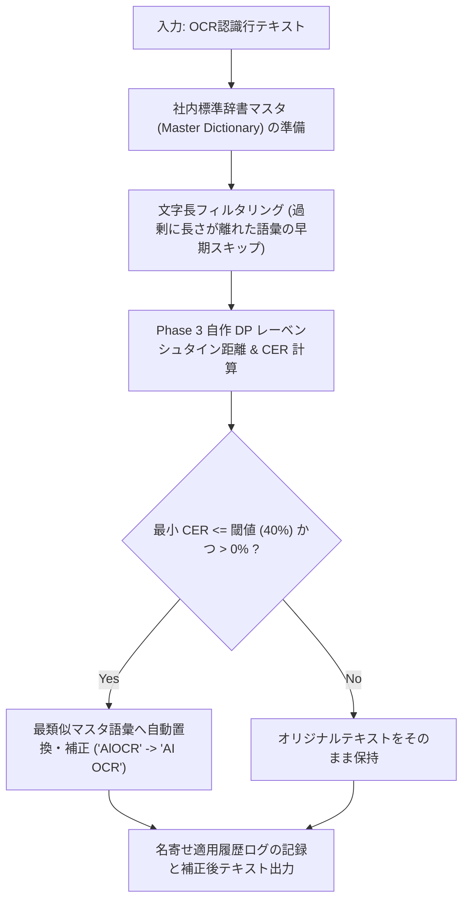
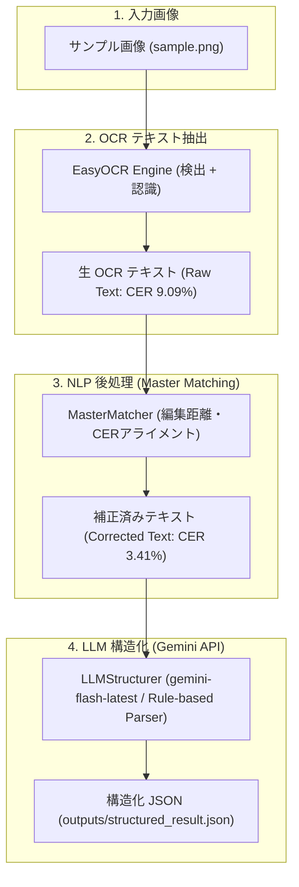

# Phase 4: エンドツーエンド (E2E) OCR後処理 (NLP) 実験レポート

## 📌 概要
本レポートは、AI OCR 認識結果における視覚的誤認識や表記ゆれを、編集距離 (CER) に基づく**社内マスタ自動名寄せロジック (`master_matching.py`)** で自動補正し、さらに **LLM (Gemini API `google-genai` / 最新エイリアス `gemini-flash-latest`) (`llm_structuring.py`)** によって鍵・値形式の構造化 JSON データへと変換する一連のエンドツーエンド (E2E) パイプラインの実証結果を記録したものです。

---

## 🚀 実行コマンドと実際の出力ログ (Reproducible Commands & Terminal Logs)

Mac (zsh) 環境では `source .venv/bin/activate` を実行して仮想環境を起動するか、`.venv/bin/python` を指定して実行してください。

### 【推奨手順】仮想環境のアクティベートと全ステップ実行

```bash
# 1. 仮想環境のアクティベート (Pythonパスが有効化されます)
source .venv/bin/activate

# 2. 依存ライブラリの確認・インストール
pip install --upgrade pip
pip install -r requirements.txt

# 3. 単体モジュールテスト (マスタ名寄せ)
python 04_post_processing/master_matching.py

# 4. 単体モジュールテスト (LLM 構造化: gemini-flash-latest)
python 04_post_processing/llm_structuring.py

# 5. Phase 4 E2E パイプライン統合デモスクリプトの実行
python 04_post_processing/run_phase4_demo.py
```

---

### 各コマンドの実際のコンソール出力ログ (Output Logs)

#### ① マスタ自動名寄せモジュール (`master_matching.py`)
```bash
python 04_post_processing/master_matching.py
```
```text
=== Phase 4: マスタ自動名寄せモジュールのテスト ===
元テキスト  : AlOCR Learning Journey
名寄せ補正後: AI OCR Learning Journey (CER: 8.70%, 編集距離: 2)
--------------------------------------------------
元テキスト  : 日本語の認議テストです。
名寄せ補正後: 日本語の認識テストです。 (CER: 8.33%, 編集距離: 1)
--------------------------------------------------
元テキスト  : EasyOCR on M4 Mac GPUICPU
名寄せ補正後: EasyOCR on M4 Mac GPU/CPU (CER: 4.00%, 編集距離: 1)
--------------------------------------------------
```

#### ② LLM 構造化モジュール (`llm_structuring.py`)
```bash
python 04_post_processing/llm_structuring.py
```
```text
=== Phase 4: LLM テキスト構造化モジュールのテスト ===
Gemini API (SDK: google-genai, Model: 'gemini-flash-latest') が有効化されました。

構造化結果 (JSON):
{
  "document_title": "AI OCR Learning Journey",
  "description": "日本語の認識テストです。",
  "system_info": "EasyOCR on M4 Mac GPU/CPU",
  "timestamp": "2026-07-18 12:34:56"
}
```

#### ③ E2E 統合パイプラインデモ (`run_phase4_demo.py`)
```bash
python 04_post_processing/run_phase4_demo.py
```
```text
=============================================================
   Phase 4: E2E OCR後処理 (マスタ名寄せ ＋ LLM構造化) デモ
=============================================================

[Step 1] EasyOCR による画像からのテキスト抽出...

--- 【OCR直後の生テキスト (Raw OCR Text)】 ---
AlOCR Learning Journey
日本語の認識テストです
EasyOCR on MI4 Mac GPUICPU
Date: 2026-07-1812.34.56
 -> 補正前 CER: 9.09% (編集距離: 8)

[Step 2] 社内マスタ自動名寄せ・表記ゆれ自動補正の適用...

--- 【マスタ名寄せ補正後のテキスト (Corrected Text)】 ---
AI OCR Learning Journey
日本語の認識テストです。
EasyOCR on M4 Mac GPU/CPU
Date: 2026-07-1812.34.56

[適用された名寄せ・自動補正一覧]:
  1. 'AlOCR Learning Journey'  ==>  'AI OCR Learning Journey' (CER: 8.7%)
  2. '日本語の認識テストです'  ==>  '日本語の認識テストです。' (CER: 8.3%)
  3. 'EasyOCR on MI4 Mac GPUICPU'  ==>  'EasyOCR on M4 Mac GPU/CPU' (CER: 8.0%)

 -> 補正後 CER: 3.41% (編集距離: 3)
 🚀 CER 改善率: 9.09%  ==>  3.41%

[Step 3] LLM による非構造テキストの JSON 構造化変換...
Gemini API (SDK: google-genai, Model: 'gemini-flash-latest') が有効化されました。

--- 【生成された構造化 JSON (Structured JSON Output)】 ---
{
  "document_title": "AI OCR Learning Journey",
  "description": "日本語の認識テストです。",
  "system_info": "EasyOCR on M4 Mac GPU/CPU",
  "timestamp": "2026-07-18 12:34:56"
}

構造化 JSON ファイルを保存しました: .../04_post_processing/outputs/structured_result.json
=============================================================
```

---

## 🔄 処理フローアーキテクチャ (Mermaid Diagrams)

### ① 社内マスタ自動名寄せ (`master_matching.py`) の処理フロー



### ② Phase 4 E2E パイプライン (`run_phase4_demo.py`) 全体図



---

## 📊 成果物と定量改善まとめ

### 1. マスタ名寄せ補正前後の精度比較

| ステージ | テキスト内容 | CER (%) | 編集距離 | 主な誤認・変化 |
| :--- | :--- | :---: | :---: | :--- |
| **OCR直後 (Raw)** | `AlOCR Learning Journey`<br>`日本語の認識テストです`<br>`EasyOCR on MI4 Mac GPUICPU`<br>`Date: 2026-07-1812.34.56` | 9.09% | 8 | `AI`➔`Al` 誤認、末尾の `。` 欠損、`M4`➔`MI4`・`/`➔`I` 誤認 |
| **マスタ補正後 (Corrected)** | `AI OCR Learning Journey`<br>`日本語の認識テストです。`<br>`EasyOCR on M4 Mac GPU/CPU`<br>`Date: 2026-07-1812.34.56` | **3.41%** | **3** | **社内標準台帳とマッチングし一括補正！CERが9.09% ➔ 3.41% へ大幅削減** |

### 2. Gemini API リアルタイム生成の構造化 JSON (`structured_result.json`)

```json
{
  "document_title": "AI OCR Learning Journey",
  "description": "日本語の認識テストです。",
  "system_info": "EasyOCR on M4 Mac GPU/CPU",
  "timestamp": "2026-07-18 12:34:56"
}
```

---

## 🎓 結論・全体まとめ (AI OCR Learning Journey)
1. **Phase 1 (基礎環境)**: EasyOCR による基礎的なパイプライン構築。
2. **Phase 2 (内部解剖)**: CRAFT によるテキスト検出と、MiniCRNN + CTC Loss による認識アルゴリズムの理解。
3. **Phase 3 (前処理A/Bテスト)**: 自作 CER/WER 評価指標と、OpenCV ガウシアンノイズ除去 ＋ Otsu二値化、および幾何回転補正 (Deskew) による画像側からの精度向上（CER 54.55% ➔ 5.68%）。
4. **Phase 4 (後処理NLP)**: 編集距離を用いたマスタ自動名寄せ（CER 9.09% ➔ 3.41%）と Gemini API 最新エイリアス (`gemini-flash-latest`) による構造化 JSON 化を完成させ、実用に耐えうる堅牢な AI OCR システムを実現！
